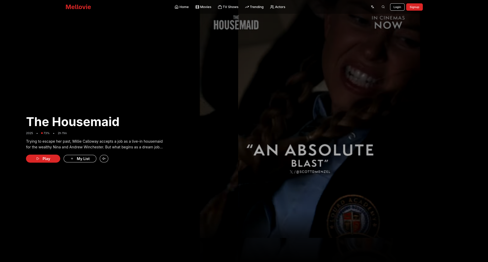

# Mellow - Movie & TV Show Explorer




Mellow is a modern, responsive web application built with React and TypeScript for discovering and managing movies and TV shows. It integrates with The Movie Database (TMDb) API to provide detailed information, trailers, cast details, and user-specific features like favorites and ratings. The app supports multiple languages (English and Indonesian), dark theme, and user authentication.

## Features

- **Browse Movies & TV Shows**: Explore popular, trending, and genre-filtered content with pagination.
- **Detailed Views**: Access movie/TV show details, trailers, cast, and similar recommendations.
- **Search & Discover**: Search across movies, TV shows, and collections; discover by genre, year, or ratings.
- **User Authentication**: Login via TMDb to access personalized features.
- **Favorites & Ratings**: Add/remove favorites and rate movies/TV shows.
- **Responsive UI**: Optimized for desktop and mobile with a sleek dark theme.
- **Internationalization**: Support for English and Indonesian languages.
- **Lazy Loading**: Optimized performance with lazy-loaded components.

## Tech Stack

- **Frontend**: React 19, TypeScript, Vite
- **Styling**: Tailwind CSS, Radix UI components
- **Routing**: React Router DOM
- **API**: TMDb API (via Axios)
- **State Management**: React Context (for auth)
- **Internationalization**: react-i18next
- **Icons**: Lucide React
- **Build Tools**: Vite, ESLint, PostCSS
- **Deployment**: Vercel-ready

## Installation

1. **Clone the repository**:
   ```bash
   git clone https://github.com/your-username/mellow-movie_TMDb-api.git
   cd mellow-movie_TMDb-api
   ```

2. **Install dependencies**:
   ```bash
   npm install
   ```

3. **Set up environment variables**:
   - Copy `.env.example` to `.env.local`.
   - Add your TMDb API key: `VITE_TMDB_API_KEY=your_api_key_here`.
   - Obtain an API key from [TMDb](https://www.themoviedb.org/settings/api).

4. **Run the development server**:
   ```bash
   npm run dev
   ```
   Open [http://localhost:5173](http://localhost:5173) in your browser.

5. **Build for production**:
   ```bash
   npm run build
   npm run preview
   ```

## Usage

- **Home Page (/)**: View trending movies with hero trailers, browse sections, and actor lists.
- **Movies (/movie)**: Browse popular movies, filter by genre, and paginate.
- **TV Shows (/tv)**: Browse popular TV shows, filter by genre, and paginate.
- **Details (/movie/:id or /tv/:id)**: View detailed info, trailers, cast, and similar content.
- **Actors (/actors)**: Explore trending actors.
- **Profile (/profile)**: Manage your account (requires login).
- **Favorites (/favorites)**: View your favorite movies and TV shows (requires login).
- **Login (/login)**: Authenticate with TMDb credentials.

## Contributors

This project was developed by a dedicated team with the following roles and responsibilities:

- **Maulidani Brian Melvino**: Fullstack developer responsible for overall architecture, API integration, and UI components.
- **Reifan Hanafi**: Backend developer focusing on TV show API endpoints and related UI features.
- **Tito Tegar**: Backend developer handling movie API endpoints and associated UI elements.
- **Citra**: Frontend developer creating basic UI layouts and reusable components.
- **Naviz**: QA engineer managing component quality assurance, with a focus on Keil components and actors UI.

## License

This project is licensed under the MIT License. See the LICENSE file for details.
